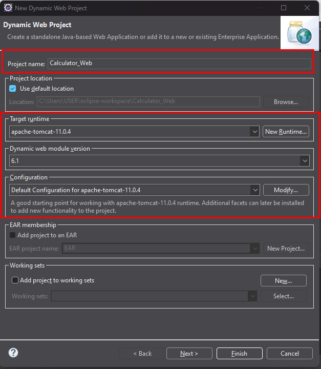
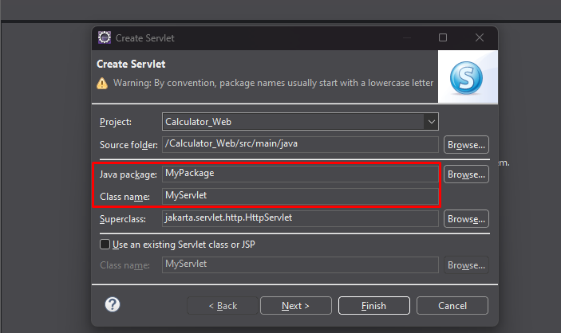
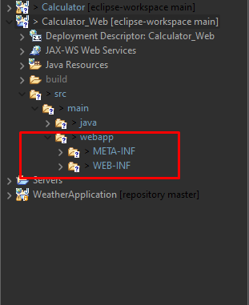
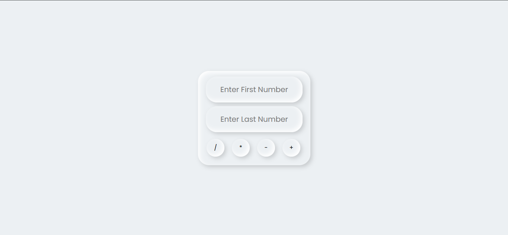
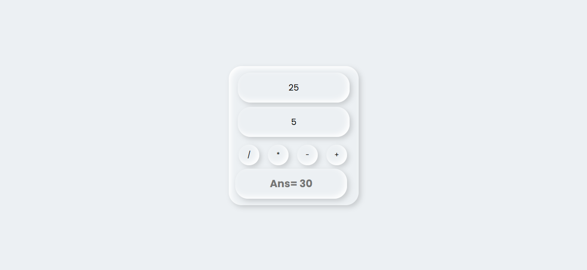

# Calculator Project

This is a simple web-based calculator application that performs basic arithmetic operations such as addition, subtraction, multiplication, and division.

## Features

- Input two numbers for calculation.
- Perform basic arithmetic operations:
  - Addition
  - Subtraction
  - Multiplication
  - Division
- Responsive design with a modern UI.

## Project Structure

```
Calculator/
├── src/
│   ├── main/
│   │   ├── java/
│   │   │   ├── MyPackage/
│   │   │   │   ├── MyServlet.java
│   │   ├── webapp/
│   │   │   ├── index.html
│   │   │   ├── style.css
│   │   │   ├── result.jsp
├── build/
├── .classpath
├── .project
├── .gitignore
```

## Technologies Used

- **Frontend**: HTML, CSS
- **Backend**: Java Servlet
- **Libraries**: Jakarta Servlet API

## How to Run

1. Clone the repository to your local machine.
2. Open the project in your IDE (e.g., Eclipse).
3. Deploy the application on a servlet container (e.g., Apache Tomcat).
4. Access the application in your browser at `http://localhost:8080/Calculator`.

## Configuration

- The `web.xml` file in the `WEB-INF` directory configures the servlet mappings.
- The `MyServlet.java` file handles the backend logic for arithmetic operations.


## Additional Setup Instructions

If you face any problem running the project, follow these steps:

1. **Create a Java Dynamic Web Project** in Eclipse IDE. Set up all dependencies as shown in the picture below:
   - 

2. **Create a Servlet**:
   - Java Package: `MyPackage`
   - Class Name: `MyServlet`
   - 

3. Copy the repository's Servlet code into your servlet file.

4. Add all the files (`index.html`, `result.jsp`, `style.css`) under the `webapp` folder. 
   - 

5. Run the project using the Apache Tomcat server.

## Screenshots

### Calculator Interface

##
### Calculator Details


## Video

https://github.com/user-attachments/assets/a97710fe-a56d-4c1e-9b71-dd2a39177739


## Additional Notes

- Ensure that the required servlet libraries are added to your project.
- Modify the `result.jsp` file to customize the output display.

# Thank You!

