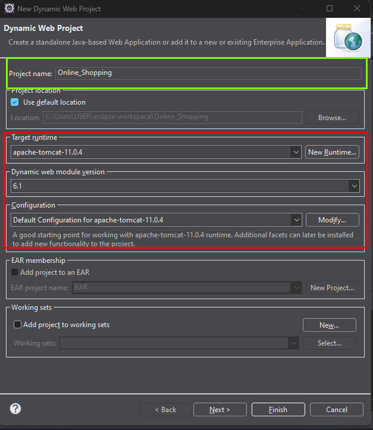
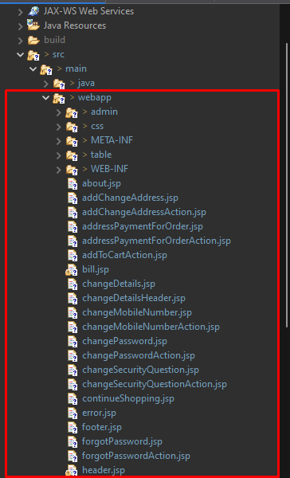
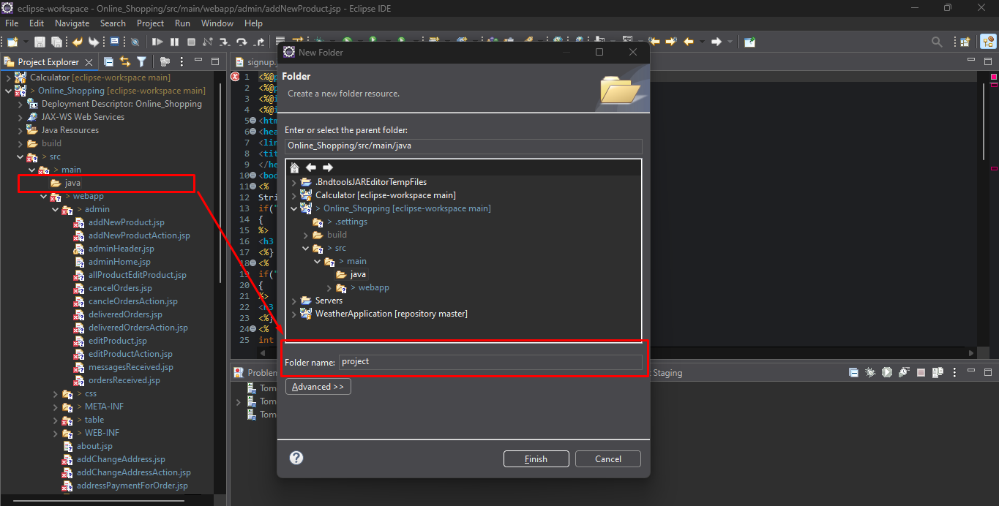
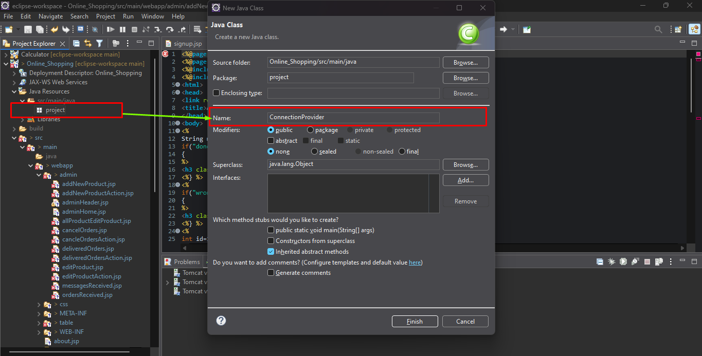
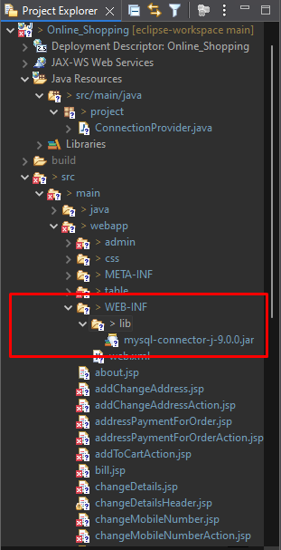

# Online Shopping Project (CRUD)

This is a web-based **CRUD** (`Create, Read, Update, and Delete`) application for online shopping, allowing users to browse products, add items to their cart, and complete purchases.

## Features

- User authentication and registration.
- Product browsing and search functionality.
- Shopping cart management.
- Order placement and tracking.
- Admin panel for managing products and orders.

## Project Structure (Short)
```
Online_Shopping/
├── src/
│   ├── main/
│   │   ├── java/
│   │   │   ├── MyPackage/
│   │   │   │   ├── MyServlet.java
│   │   ├── webapp/
│   │   │   ├── index.html
│   │   │   ├── style.css
│   │   │   ├── cart.jsp
│   │   │   ├── checkout.jsp
├── build/
├── .classpath
├── .project
├── .gitignore
```

## Technologies Used

- **Frontend**: HTML, CSS, JavaScript
- **Backend**: Java Servlet
- **Database**: MySQL
- **Libraries**: Jakarta Servlet API

## How to Run

1. Clone the repository to your local machine.
2. Open the project in your IDE (e.g., Eclipse).
3. Deploy the application on a servlet container (e.g., Apache Tomcat).
4. Access the application in your browser at `http://localhost:8080/Online_Shopping/signup.jsp`.

## Configuration

- The `web.xml` file in the `WEB-INF` directory configures the servlet mappings.


## Additional Setup Instructions


1. **Create a Java Dynamic Web Project** in Eclipse IDE. Set up all dependencies as shown in the picture below:
   - 

2. Add all the files & folders (`index.html`, `cart.jsp`, `checkout.jsp`, `style.css`, `etc...`) under the `webapp` folder.
   - 

3. Create a folder `project` under the `java` folder.
   - 

4. Also create class file `ConnectionProvider`.
   - 
   - Copy the repository's code into your file.

5. Add the required `mysql-connector` (`JAR`) files to the lib folder and import all dependencies:
   - 

6. Run the project using the Apache Tomcat server.

## Database Setup

1. At first, create a database named `online_shopping` using MySQL.
2. Configure the database connection in `ConnectionProvider.java` (if you follow the instructions below, you don't need to modify it manually).
3. Navigate to `create_tables.jsp` in your browser.
4. Uncomment the following lines on by one in `create_tables.jsp`:
```java
// st.execute(q1);
// st.execute(q2);
// st.execute(q3);
// st.execute(q4);
```
5. Run the `create_tables.jsp` file. This will create the required tables in your database.

Now you can run the full project.

## Screenshots

### Home Page


### Shopping Cart


## Additional Notes

- Ensure that the required servlet libraries are added to your project.
- Modify the JSP files to customize the user interface.

# Thank You!
