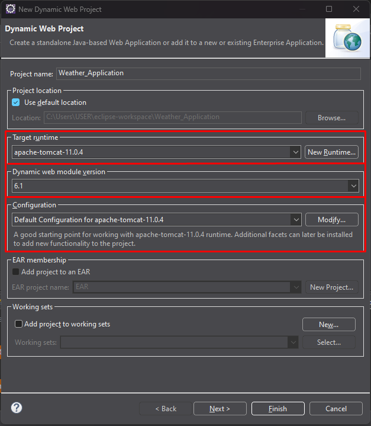
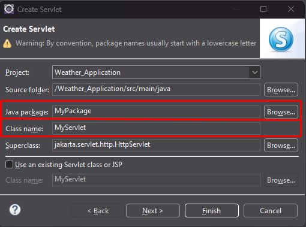
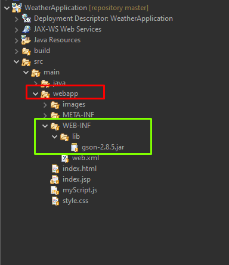
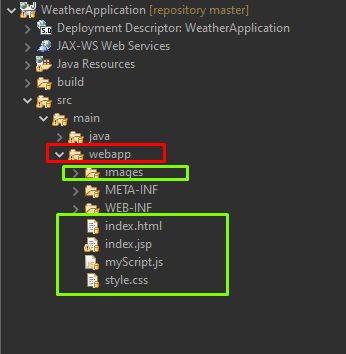
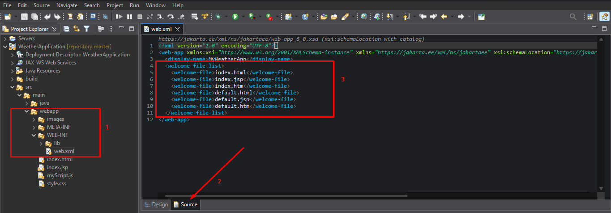
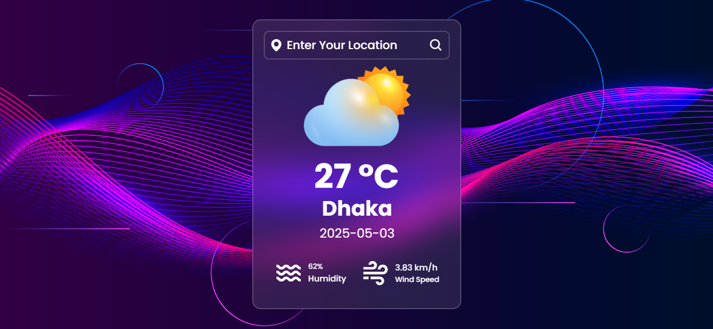

# Weather Application

This is a simple weather web application that allows users to search for weather conditions in their location. The application displays temperature, humidity, wind speed, and weather conditions using a clean and responsive user interface.

## Features

- Search for weather conditions by city.
- Displays temperature, humidity, and wind speed.
- Dynamic weather icons based on weather conditions.
- Responsive design with a modern UI.

## Project Structure

```
WeatherApplication/
├── README.md
├── src/
│   ├── main/
│   │   ├── webapp/
│   │   │   ├── index.html
│   │   │   ├── index.jsp
│   │   │   ├── myScript.js
│   │   │   ├── style.css
│   │   │   ├── images/
│   │   │   │   ├── 404.png
│   │   │   │   ├── background.jpg
│   │   │   │   ├── clear.png
│   │   │   │   ├── cloud.png
│   │   │   │   ├── Clouds.png
│   │   │   │   ├── mist.png
│   │   │   │   ├── rain.png
│   │   │   │   ├── snow.png
│   │   │   ├── META-INF/
│   │   │   │   ├── MANIFEST.MF
│   │   │   ├── WEB-INF/
│   │   │   │   ├── web.xml
│   │   │   │   ├── lib/
│   │   │   │   │   ├── gson-2.8.5.jar
```

## Technologies Used

- **Frontend**: HTML, CSS, JavaScript
- **Backend**: JSP (Java Server Pages)
- **Libraries**: Font Awesome, Boxicons
- **Styling**: Google Fonts (Poppins)

## How to Run

1. Clone the repository to your local machine.
2. Open the project in your IDE (e.g., Eclipse).
3. Deploy the application on a servlet container (e.g., Apache Tomcat).
4. Access the application in your browser at `http://localhost:8080/WeatherApplication`.


## Configuration

- The `web.xml` file in the `WEB-INF` directory configures the welcome files and servlet mappings.
- Weather icons are dynamically updated in `myScript.js` based on the weather condition.

## Additional Setup Instructions

If you face any problem running the project, follow these steps:

1. **Create a Java Dynamic Web Project** in Eclipse IDE. Set up all dependencies as shown in the picture below:
   - 

2. **Create a Servlet**:
   - Java Package: `MyPackage`
   - Class Name: `MyServlet`
   - 

3. Copy the repository's Servlet code into your servlet file.

4. Add the required JAR files to the `lib` folder and import all dependencies:
   - 

5. Add all the files (`index.html`, `index.jsp`, `myScript.js`, `style.css`) under the `webapp` folder. Also, add the `images` folder under `webapp`:
   - 

6. Open the `web.xml` file and configure the URLs:
   - 

7. Run the project using the Apache Tomcat server.

## Screenshots

### Home Page


### Weather Details



## Documentation

Check out my Java projects on [DeepWiki](https://deepwiki.com/alaminhossainrifat/Java_Projects).

# Thank You!!